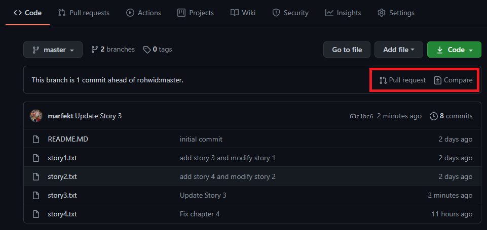
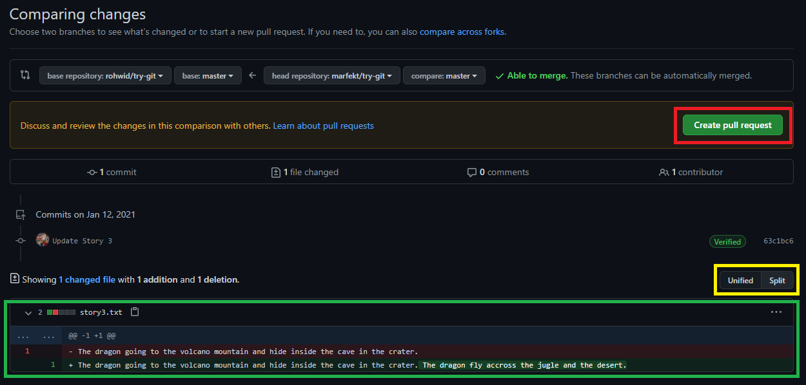
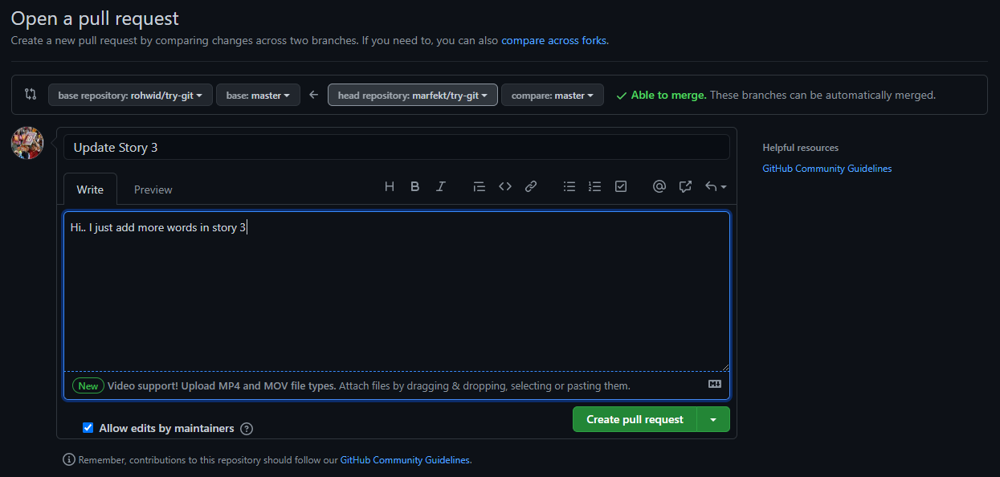
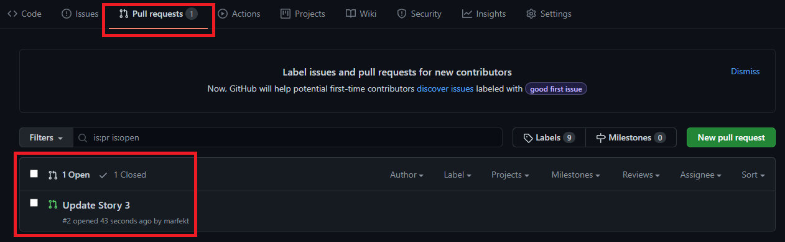
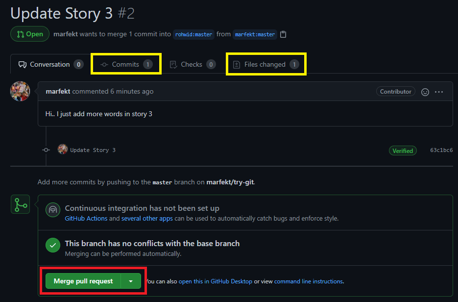
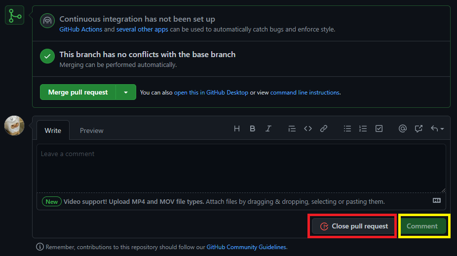
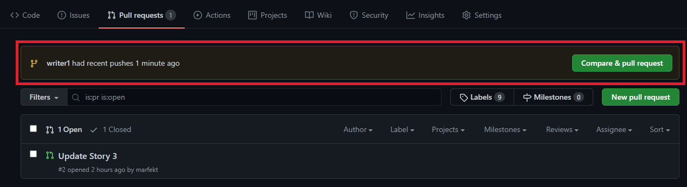

# How to Pull Request

Fot this case I using GitHub as the Remote Repository Example. Then here's the common step that you should follow to know about `pull-request`. The `pull-request` itself means that you request to the owner of the repository or project to accept your suggestion. It can be the documentation in the form of a markdown file or fix the owner codes. So, that process will be expain with two repositories the first is as a contributor of the project and the second is the project owner. Here are the explaination about the pull request: 

## Pull Request (as a Contributor)

Here are all the steps to do th pull request:

+ The first thing that you should do is **fork** the project or copy the project and set yourself as the owner.
+ Then **edit** the project, it same as you're the owner of that project.
+ You must do the **commit** and **push** the **forked project** to your GitHub repository as usual.
+ Now you can do the **pull request** by accessing the menu as shown in the image which marked by *red box* below.

    

+ In the image that shown belelo. You looks at the *green box* to compare the differences between you as contributor to the main repository that you have forked. The *yellow box* is the menu to change the comparation's display. And the *red box* is the button to create the pull request, it means you're already check the differences.

    

+ Add comment before create pull request as shown in the image below.

    

## Pull Request (as a Project Owner)

Here are all the steps to accept pull request:

+ The first thing after the pull request comming, there will be an incomming notification notification like the image that shown in this picture below.

    

+ After you opened the notification, you can see and review the difference between your project and the contributor code in the menu that shown in images below within the *yellow box*. When you decide to merge with your project, just click the Merge pull request within *red box*.

    

+ If you wanna close the pull request just click Close pull request button within the *red box*, but if you wanna leave comment first before close, it was optional option. The other option to make the better contribution is with comment menu, it can used by project owner and the contributor to gives comment each other. That menu shown in images below within yellow box and leave comment in comment section.

    

## Pull Request (as the Member of Project but in Different Branch)

Here are all the steps to pull request after push some lines of the code in the other branch except master:

+ There will be an offer to create pull request after push some code in diffrent or new branch to do the pull request to master branch or other branch, as shown in image below.

    

+ After it you will follow the step same as the `Pull Request (as a Contributor)`.
+ Then the other or master branch maintainer will follow the step same as the `Pull Request (as a Project Owner)`.