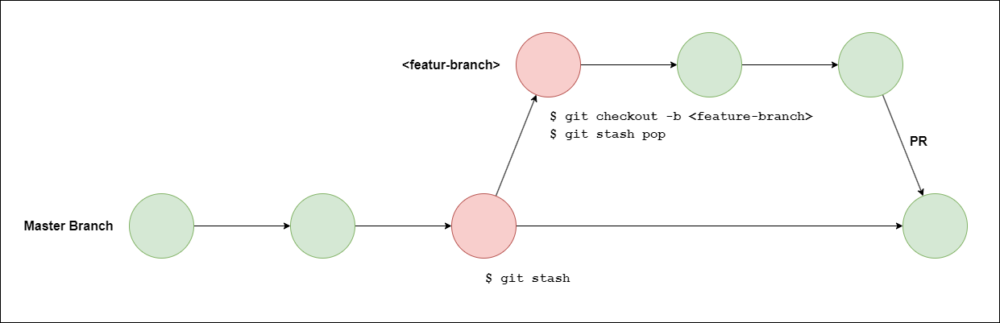

# **Stash and Pop**

Accidentally we forget where we stand, which in the `master` branch then cotinue working for the new feature that suppose to be in the `feature-branch`. So, what we suppose to do? The statsh and pop may be a solution like this step:

Stash the changes and automatically ignore changes:

    $ git checkout master
    $ git stash

Now continue by creating new branch and get the stashed or ignored changes before to the new feature branch:

    $ git checkout -b <new-feature-branch>
    $ git statsh pop

The finally we can continue create new features, and create PR to the master later.

## **Ilustration**

