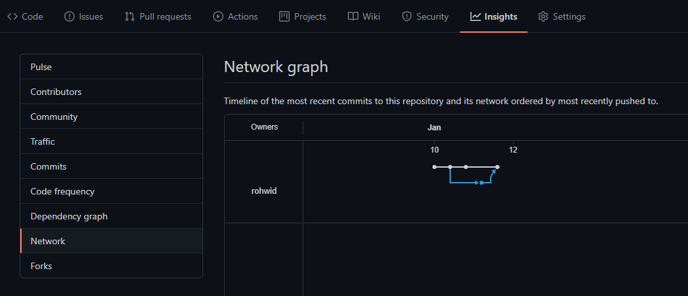

# Try Git

Just an example to explain the git **merging**, **branching**, **pull request**, and **issues**. Here's the challenge:

- Use the story directory to became a repository
- **Init** git project
- Add README.MD (Optional)
- Create `story1.txt` then **add and commit**
- Create `story2.txt` then **add and commit**
- Create GitHub, GitLab or BitBucket repository
- **Add the remote repository (SSH is a must)**
- **Push** the project to the repository
- **Add new branch** with `writer1` name
- **Switch** to the `writer1` branch
- Create `story3.txt`
- Modify the `story1.txt` then **add and commit**
- **Push** the project to the repository
- **Switch** to the `master` branch
- Create `story4.txt`
- Modify the `story2.txt` then **add and commit**
- Push the project to the repository
- **Switch** to the `writer1` branch
- **Merge** the `writer1` branch into `master`
- Push the `master` branch

The expected output should be like the images below, you can access within **Insight** menu then select **Network**.

